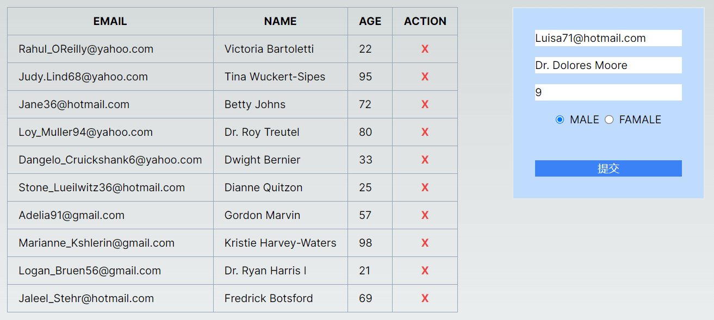

It's a demo of using Next.js 14 server action.

## Getting Started

1. install dependencies:

```bash
npm install
```

2. Generate database:

```bash
npm run db:push
```

2. run the development server:

```bash
npm run dev
# or
yarn dev
# or
pnpm dev
# or
bun dev
```

Open [http://localhost:3000](http://localhost:3000) with your browser to see the result.

